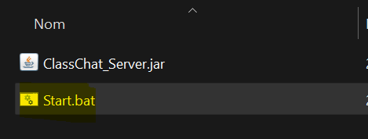
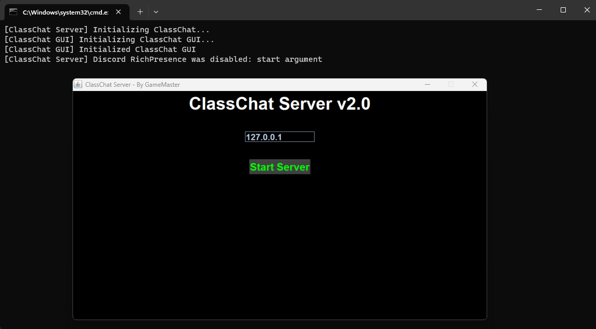

 
  
  

  
  
  
  

<h1>ClassChat Server v2.0</h1>

## 📜 Description 
 

ClassChat is an application for discussion, it's not the better, not the best but <b>it's simple !</b>  
You only need to have the [Java Runtime](https://javadl.oracle.com/webapps/download/AutoDL?BundleId=249203_b291ca3e0c8548b5a51d5a5f50063037) installed. <b>This part is the server of ClassChat, how handle the clients</b>, 
he send and receive the sockets.

## 🛠️ Utilisation

- Be sure to have the [Java Runtime](https://javadl.oracle.com/webapps/download/AutoDL?BundleId=249203_b291ca3e0c8548b5a51d5a5f50063037) installed otherwise it doesn't work, there are many tutorials on youtube, i recommend this one: [How to Install Java JRE (Java Rutime Environment) on Windows 10](https://www.youtube.com/watch?v=Zx3ceLdFm64)
  
- Download the <b>latest release</b> on github extract it and launch the file `Server.bat`  

- Now you have Start the Server and enjoy ;)

## ⚙️ Features

- Supports Multiple Clients at the same time
- Supports Client Connections on the same network
- Error Handler
- Discord RPC (Disabled by Default)
- Logger

## 🧰 Dependencies

- Java
- [Discord RPC Lib-All](../libs/java-discord-rpc-2.0.1-all.jar)